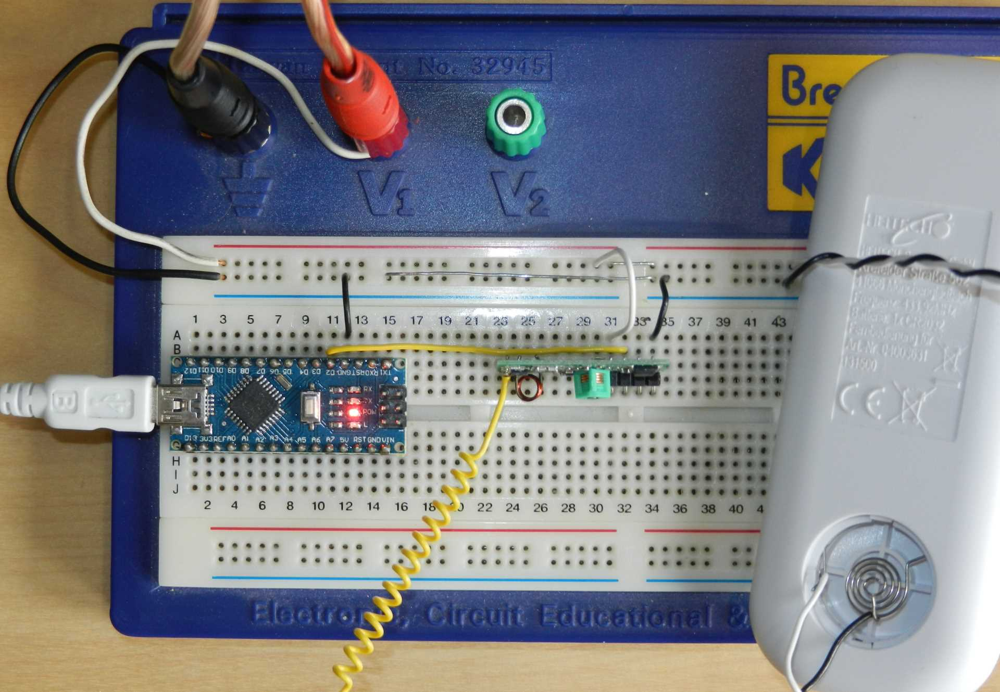
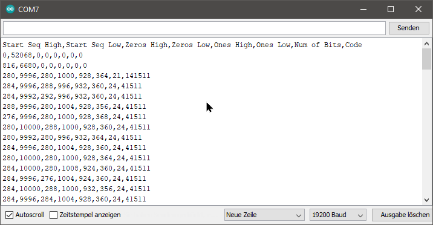
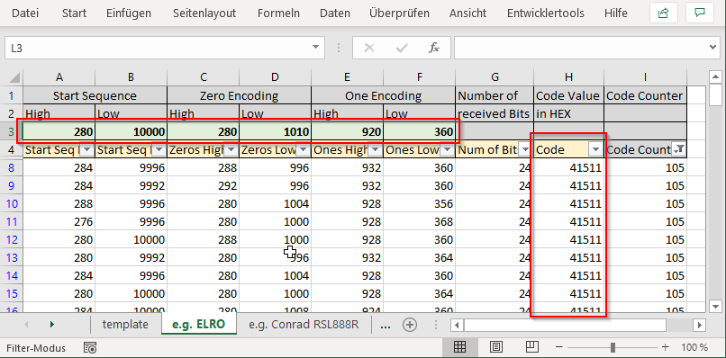

# rspo-sniffer
Arduino 433 MHz Remote Switched Power Outlet Universal Protocol Sniffer

## Introduction

This sniffer is developed and tested on an Arduino Nano.
The output of the serial interface can be further analyzed with the analyze_protocol.xlsx.
The found protocol and code can then be used used with
[rc-switch](https://github.com/sui77/rc-switch)
combined with [433Utils](https://github.com/ninjablocks/433Utils)
or with [rspo-lite](https://github.com/eesar/rspo-lite).
Both ways where tested on a Raspberry-Pi 3b to control ***Remote Switched Power Outlet (RSPO)***.

If you like to know the origin of the rspo-sniffer and rspo-lite have a look to the blog entry
[Remote Switched Power Outlet]((https://eesar.github.io/))
on my github page.

## Bill of Material

* [Arduino Nano](https://www.amazon.de/Kaemma-ATMEGA328P-Bootloader-Controller-CH340-USB-Treiber/dp/B07W1K13RS)
* [433 MHz Receive and Sending Set](https://www.amazon.de/gp/product/B00OLI93IC)
* 433 MHz Antenna [DIY](https://www.instructables.com/id/433-MHz-Coil-loaded-antenna/)
or [Commercial](https://www.amazon.de/Antenne-Helical-Antenne-Fernbedienung-Arduino-Raspberry/dp/B00SO651VU)
* [RSPO](https://www.amazon.de/gp/product/B07BHQFZSJ)
* [rspo-sniffer](https://github.com/eesar/rspo-sniffer)
* [Arduino IDE](https://www.microsoft.com/de-de/p/arduino-ide/9nblggh4rsd8)

## How To Use, as short as possible

### Connect

1. beef up the receiver - without, nothing useful was happened in my case
    - use an own power supply between 5 V and 6 V instead of the Arduino 5 V pin
      - the Arduino 5 V pin had only ~ 4.5 V
      - the USB-Charger had ~ 5.2 V
    - solder the antenna to the RCV
2. connect everything
    - USB-Charger to power rail of breadboard
    - RCV GND pin to ground rail of breadboard
    - RCV VCC pin to power rail of breadboard
    - **Arduino GND pin to ground rail of breadboard** (that is important)
    - RCV Data pin (one of the both in middle, they are connected) to the Arduino pin D2
    - Arduino to the PC

### Sniff

1. load the rspo-sniffer to the Arduino
    - check this repository out to Documents/Arduino (folder and .ino needs to be same name)
    - open rspo-sniffer.ino with Arduino IDE
    - select com port, Arduino board type and bootloader type
    - compile and upload
    - start serial window
    - **change baud rate to 192000**
2. start sniffing
    - hold the remote near to the antenna
    - press and hold one button, in my case
      - the remote needed to touch the antenna for a good signal
      - and for the HEITECH remote which has only a 3 V battery I removed the battery and connected the 5 V from the USB-Charger to the remote, else the signal was not strong enough to get received.
    - the Arduino on-board LED will lite up continuously not just blinking, when the receiving is good
    - send `on` via the serial window, still holding the remote button
    - wait a few seconds, the serial window should print a lot of numbers
    - send `off` via the serial window, to stop the recording
      - you may have to send `off` several times, since the protocol sniffing is done in an interrupt

### Analyze the Sniffed Data

1. open the Excel file contained in rspo-sniffer analyze_protocol.xlsx
2. for each button on your remote, you want to replace
   - copy the template tab to a new tab called like remote button combination e.g. 'ELRO A ON'
   - copy the sniffed data from the serial interface of this button
   - placing the header line in the yellow marked line in the excel file
   - split the data by `,` to get 8 columns with numbers
3. figure out the protocol and the button code
    - the first six columns contains the protocol
    - the seventh column shows the width of the sniffed code
    - the eighths column the code needed to be send in HEX code
    - active filter option for the yellow row
    - filter in the seventh column for a sound bit number, probably 24 or 32 bits
    - filter in the ninth column for the code with most appearances
      - and expect the unexpected e.g. the HEITECH protocol and code is really strange, it is sending 4 different 24 bits packets in 2 different protocol type
4. note the sniffed data to replicate your remote with your Raspberry-Pi
   - the protocol int the green row
   - button code

For more information about the rspo protocol and some guidance when something is not
working as explained, have a look to my github page and the
[Remote Switched Power Outlet]((https://eesar.github.io/))
blog entry.
